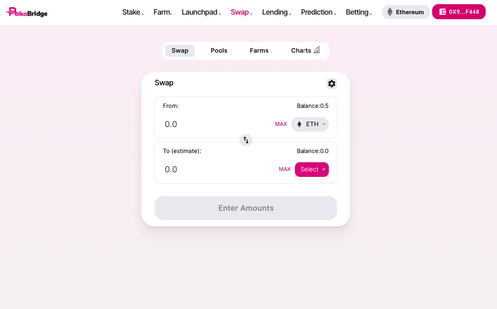
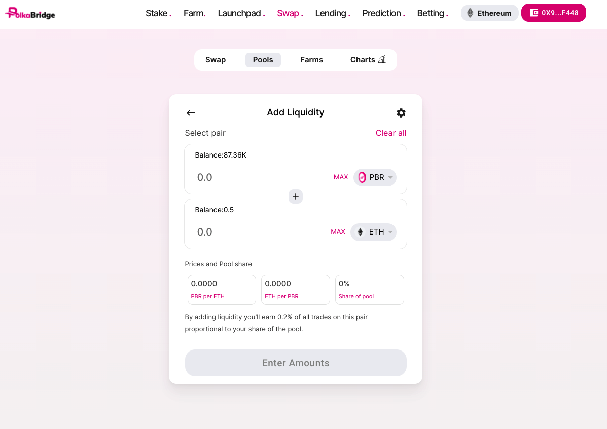
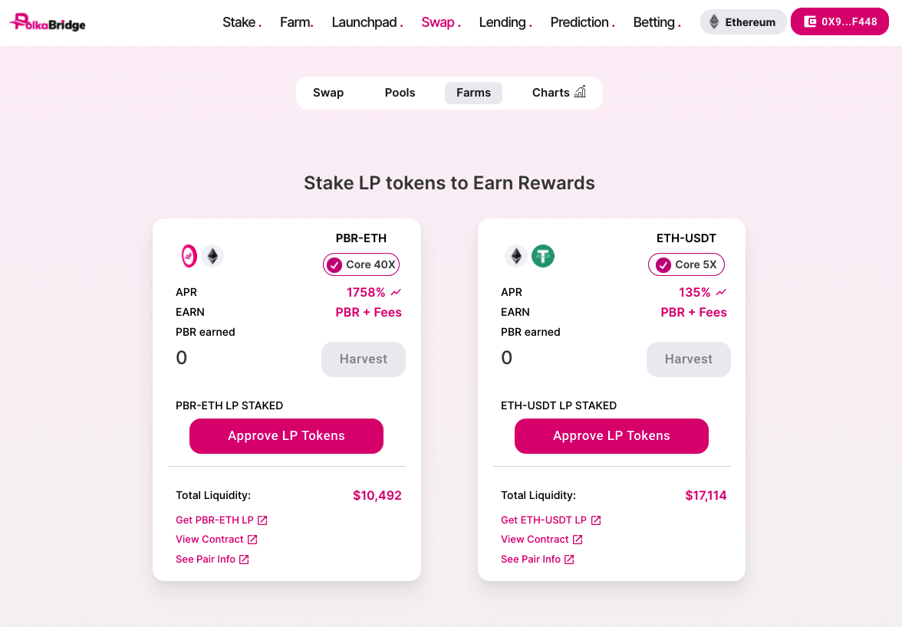

# PolkaBridge - Decentralised Exchange

With PolkaBridge Dex, Experience multi-chain and cross-chain smooth swaping using your crypto wallet.

PolkaWar is a Multichain & Cross-Chain Decentralized All-In-One PLatform To Include AMM, Farming, Lending,Launchpad, Prediction, NFT, and More.

Swap page view of PolkaBridge:

Add Liquidity Page view:

Farm Page View:

Following features are developed:

1. Metamask and Trust Wallet Connection.
2. Swaping token on different chains.
3. Farming section.
4. Analytics and dashboard.
5. Add liquidity section.

## Available Scripts

In the project directory, you can run:

### `yarn start`

Runs the app in the development mode.\
Open [http://localhost:3000](http://localhost:3000) to view it in the browser.

The page will reload if you make edits.\
You will also see any lint errors in the console.

### `yarn build`

Builds the app for production to the `build` folder.\
It correctly bundles React in production mode and optimizes the build for the best performance.

The build is minified and the filenames include the hashes.\
Your app is ready to be deployed!

See the section about [deployment](https://facebook.github.io/create-react-app/docs/deployment) for more information.
